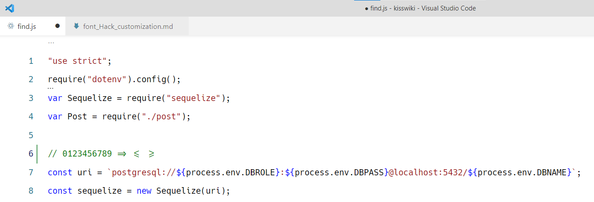

Final result in vscode:




Image from https://medium.com/source-words/hack-typeface-v3-6943991c1a80

## Windows 10

Switch to Ubuntu WSL

```
# https://stackoverflow.com/questions/41986507/unable-to-set-default-python-version-to-python3-in-ubuntu/61878185#61878185
sudo apt install pip3 python-is-python3
git clone https://github.com/source-foundry/Hack
cd Hack
# First try if works by default
./build-ttf.sh --install-dependencies
```

https://github.com/source-foundry/Hack/blob/master/docs/BUILD.md

If you got error `Unable to execute ttfautohint on the Hack-Regular variant set` you may need to do this:

```
find postbuild_processing/tt-hinting/ -type f -exec sed -i 's/uni0023/numbersign/g' {} +
find postbuild_processing/tt-hinting/ -type f -exec sed -i 's/uni0025/percent/g' {} +
find postbuild_processing/tt-hinting/ -type f -exec sed -i 's/uni002B/plus/g' {} +
find postbuild_processing/tt-hinting/ -type f -exec sed -i 's/uni0030/zero/g' {} +
find postbuild_processing/tt-hinting/ -type f -exec sed -i 's/uni0038/eight/g' {} +
find postbuild_processing/tt-hinting/ -type f -exec sed -i 's/uni0021/exclam/g' {} +
```

https://github.com/source-foundry/Hack/issues/500#issuecomment-596130056

And run again:

`./build-ttf.sh`

Now let's modify zero glif.

```
cd ..
git clone https://github.com/source-foundry/alt-hack
cd alt-hack
```

Modify lines in `patch-hack.sh`.

```diff
 # ---------------------------------------------------

 # 1. Set the path to the downloaded Hack repo here first
-HACK_PATH=""
+HACK_PATH="../Hack"

 # 2. List your alternate glyphs here
 declare -a alternates=(
-    "u00EC-slab"
-    "u00ED-slab"
-    "u00EF-slab"
-    "u012B-slab"
-    "u012D-slab"
-    "u012F-slab"
     "u0030-diamond"
-    "u0069-slab"
-    "u0129-slab"
-    "u0131-slab"
-    "u0456-slab"
-    "u0457-slab"
 )
```

I also needed to comment out lines in `Hack/postbuild_processing/tt-hinting/Hack-Regular-TA.txt`

```diff
 # U+0030 zero glyph ID 548
-uni0030 touch 35,36,45,46,47,56  y -0.5   @8
-uni0030 touch 35,36,56           y -1.0   @12,13,14
+#zero touch 35,36,45,46,47,56  y -0.5   @8
+#zero touch 35,36,56           y -1.0   @12,13,14
```

After that:

```
bash patch-hack.sh
cd ../Hack
./build-ttf.sh
```

You should have new fonts in `./build/ttf` directory.

To install on Windows just doubleclick on ttf file.

There was problem for me that there was directory with fonts `C:\Windows\Fonts\Hack` and uninstalling Hack font wasn't removing this directory and I was using old unomdified version of Hack. So I needed to delete fonts one by one from this directory and install ttf file again.

You need to restart vscode to use newly installed font.

in vscode settings.json:

```
  "editor.fontFamily": "Hack",
  "editor.fontSize": 15, // Hack
  "editor.lineHeight": 30, // Hack
```

To add ligatures:

```
git clone --recurse-submodules https://github.com/ToxicFrog/Ligaturizer
sudo apt update
sudo apt install python-fontforge -y
cp /path/to/Hack-Regular.ttf fonts/codeface/fonts/hack/
make
```

I needed to restart Windows to see the updated 'Liga Hack'.

in vscode settings.json:

```
  "editor.fontFamily": "Liga Hack",
  "editor.fontSize": 15, // Hack
  "editor.lineHeight": 30, // Hack
```
