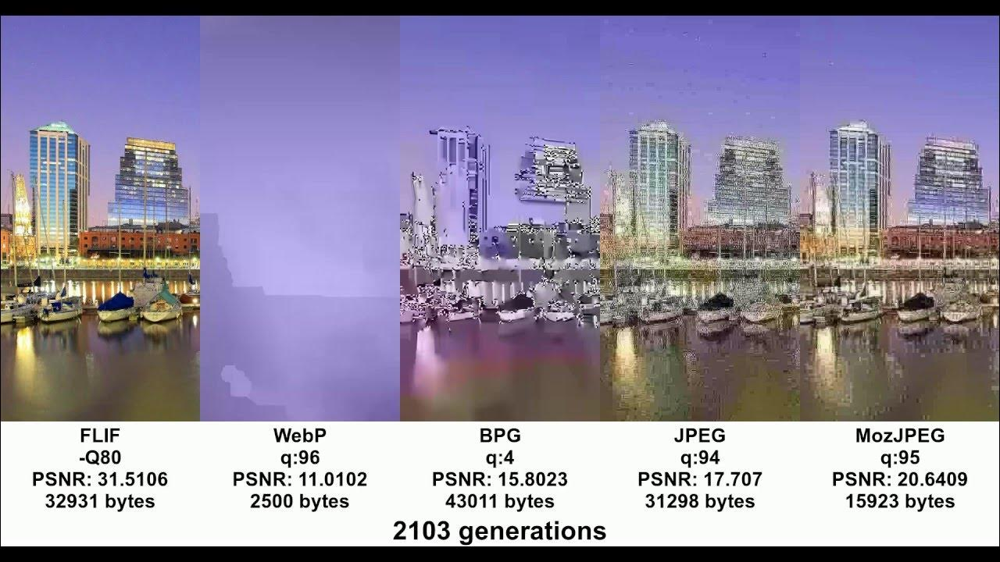

[Piotr Plenzler](https://www.facebook.com/AXYZE9/)

WebP ma gorszą kompresje od JPEG (mozjpeg) i ma jeszcze gorszy generation loss.

Google wprowadził ten format tylko po to aby wymusić adaptacje VP8 i VP9 (bo WebP to pojedyńcza klatka kodeka wideo VP8).

https://siipo.la/blog/is-webp-really-better-than-jpeg

Generation Loss. Już przy JPEG narzekamy na utrate jakości przy ktorymś przetwarzaniu z kolei, ale utrata detali ( a raczej całości sceny) przez WebP to jest next level, którego żaden kodek nie dotknie.

Jeszcze na dokładke wymuszony chroma subsampling 4:2:0 przez co lossless kompresja nie ma prawa istnieć, a drobny tekst na kolorowym tle zawsze będzie rozmazany.

"lepszy" format WebP aka:

- brak progresywnego dekodowania
- brak wielowątkowości
- przydzielanie max 1 informacji o kolorze na każdy blok 2x2 pikseli
- najgorszy generation loss ze wszystkich kodeków

Finalnie masz więc gorszą jakość, degradacje jakości z każdym zapisem, ale przynajmniej jest wolniejsze enkodowanie i dekodowanie xD

Ten format został wydany tylko dlatego że Google kupiło On2Technologies i musiało zmusić Firefoxa i Safari do wsparcia VP8. Postanowili że zrobią z pojedyńczej klatki kodeka wideo VP8 kodek do zdjęć i powstał WebP, którego zaczeli cisnąć na PageSpeed. Firefox zaczęło wspierać, ale Safari się ociągało więc Google zrobiło z VP8 defaultowy kodek WebRTC i Apple musiało zacząć wspierać VP8. W konsekwencji wtedy doszło wsparcie dla WebP Safari, cóż za zaskoczenie.

Kodek który powstał tylko po to aby zmonopolizować kolejny rynek przez Google, a wiesz o nim tylko bo Google wykorzystuje swoją pozycje (PageSpeed). Jak można to gówno chwalić xD

AVIF ma denoiser który rozwala percepcje detalu, a film grain synthesis który to naprawia nie działa na pierdylionie sprzętu np. na prockach MediaTek stosowanych w TV. Już z tego powodu nie jest to bezpośredni konkurent.

Żaden aparat ani telefon na rynku nie robi fot w WebP ani w AVIF. Robią za to w JPEG, HEIF, JPEG2000, TIFF.

A najlepsze jest to, że VP8 był designowany z myślą o low quality filmie (bo to po pochpodna VP6/7 wykorzystywanego w grach wideo do cutscenek np w NFW MW 2005) i Google kupiło go z myślą o YouTubr aby móc obniżać bitrate, a WebP to pojedyncza klatka VP8.

Gość jednak sugeruje, że "Web" to nie zdjęcia, więc sugeruje... ilustracje?

Przecież ten kodek by design NIE MOŻE dać ostrych krawędzi w przypadku jakiegokolwiek koloru.

https://www.ctrl.blog/entry/webp-sharp-yuv.html

A może Ci chodzi o monochrom? Przecież WebP nie wspiera monochromu w ogóle, można jedynie zapisywać jako RGBA.

To, że wymieniasz JPEG XL i AVIF pokazalo, że to Ty googlujesz odpowiedzi, bo JPEG XL jest bezkonkurencyjny, a AVIF jest znów pojedynczą klatką wideo, tym razem AV1 i przez to zawsze będzie miał wady nawet względem archaicznego JPEG.

https://www.facebook.com/groups/ppbit/posts/3621538704726448/
