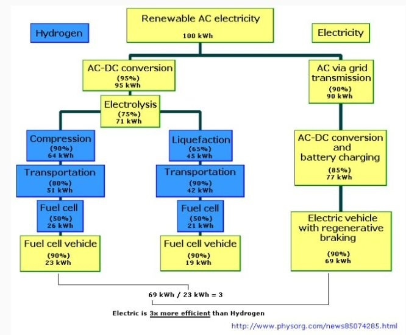
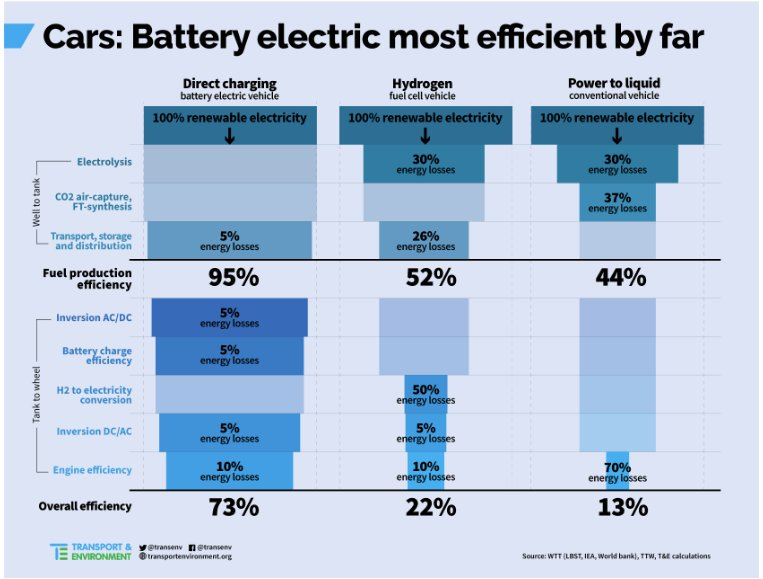

Other things that the hydrogen industry tries to keep a secret . . .
1) A typical hydrogen production station of 130 kg per day can only fuel 26 FCEVs per day or 4 Class 8 trucks
2) The third or fourth car in a fueling queue has to wait 15 or 20 minutes for the refueling tanks to re pressurize to 700 bar
3) Many/most gas stations do not have sufficient land area to accommodate a hydrogen dispensing operation for just 25 vehicles per day
4) A typical hydrogen production facility that could produce 130 kg of hydrogen per day (to support 270 vehicles at 50 km per day) costs $2.9 million USD - not including land costs
5) The hydrogen tanks in the vehicles have an expiry date rendering the entire vehicle scrap at that point
6) Hydrogen fuel stack performance degrades over time and would have to be replaced or more likely the vehicle would be scrapped due to the cost
7) Due to the danger, it is unlikely that hydrogen production stations would ever be allowed in built up areas

The source is the hydrogen tank on the Toyota MIRAI. It has an expiration date.
Also I can add, in the big European cities because of the air quality and because the fuel stack needs very clean air, the air filters need to be changed every 8k km. Source: the facebook groups of users testing these cars.
Also, once the fuel stack is started, it cannot be shutdown. If it runs out of hydrogen, you can throw it to the dumpster.
Hydrogen passengers cars are DOA. I don't even know why Toyota is even trying. Probably because they wasted billions of $ already.

In Summary

- The theory behind the 2006 IEEE paper “Does a Hydrogen Economy Make Sense?” is fully borne out in practice
-y real world data
- The concept of a fully off-grid renewables-powered hydrogen filling station is unworkable in the real world – the
-olumes of hydrogen made are pitiful. It is pure greenwash, a smokescreen to enabled the deployment of
-brown’ hydrogen derived from fossil fuels and allow incumbents to retain control of the supply chain
- There is no hydrogen vehicle that can compete with upstream grid CO2 emissions of a BEV – this applies to cars,
-uses and trains. Renewable energy is more effective when sold to the grid in reducing overall emissions
- An investment of billions is needed to build out hydrogen infrastructure. Millions in public funding has already
-een put into sites that can sustainably fill at best a handful of cars per day
- The advocates for hydrogen are often some of the world’s biggest companies, yet they are unwilling to self-fund
-his infrastructure build
- Every Pound, Dollar, Euro or Yen put into funding hydrogen could have been orders of magnitude more effective
at reducing oil dependence and greenhouse g

[Hydrogen Presentation Short.pdf](https://www.dropbox.com/s/tk51qsffhoy3ray/Hydrogen Presentation Short.pdf)

Elon Musk calls these things hydrogen fool cells.

https://electrek.co/2019/06/11/hydrogen-station-explodes-toyota-halts-sales-fuel-cell-cars/

##

Tak tak. Trwają prace. Wodór to paliwo przyszłości. I zawsze będzie paliwem przyszłości, a nie teraźniejszości. Fool-cells zamiast fuel-cells.

A z tym lobby producentów samochodów to już w ogóle przywaliłeś.

The 5–10 minute speed of refueling sounds nice. But after refueling one vehicle, the station needs about 20 minutes to pressurize enough hydrogen to fill the next vehicle. In economic terms of the station operator, a €1,500,000 station can service 3 vehicles per hour. For the same amount, one can build an electric charging station with 12 outlets that can charge 36 vehicles per hour. The mass migration in summer to the Mediterranean and in winter to the Alps is a challenge for the current gasoline refilling infrastructure. Waiting times over an hour at a filling station along the highway are not unusual.

Due to the inefficiency of the hydrogen cycle, the energy used per kilometer is three times as high in a well-to-wheel calculation as the energy used in a 100% battery-electric vehicle (BEV). In a decarbonized energy economy, this electricity is coming from wind, hydro, and solar energy options. The hydrogen cost is three times higher than electricity for BEVs using these sources. I will not even comment on the current natural gas–based hydrogen production process, because that gas should stay in the ground.

Hydrogen comes from natural gas. More hydrogen = more natural gas sales, exploration, production, revenue. (Green hydrogen is an infeasible myth for at least a decade or two, and is completely contingent upon R&D breakthroughs. Perhaps not as bad as nuclear fusion that’s 20 years away and always will be, but it appears to be a close 2nd).

I read that the Toyota Mirai has a limit on the tanks (warranties for 8 years / 100,000 miles). If they aren’t changed at some time period, the car won’t go. But that is a good point, more than just the tank could leak and will need replacement and presumably - periodic inspection.

Batteries are lighter than fuel cells and hydrogen tanks. Tesla battery weights less than 450 kg. It is almost less weight than similarly powerful and high torque combustion engine driveline, such as Audi A4 TDi. This is also the reason why Toyota Mirai weights 1850 kg although it is smaller and certainly less roomy car than Tesla Model 3 that weights 1650 kg or 200 kg less than Mirai.

Hydrogen is especially horrible for heavy long haul trucks as it is more expensive than electricity. Tesla's solar charging system can provide cost of electricity at 7 cents per kWh and charging times around 30-45 minutes. Or perfect for driver coffee breaks. Hydrogen costs about 12 dollars per kg and even in best case more than six dollars per kg.

This means in practice that Tesla's truck saves 100-200 000 dollars annually compared to significantly more expensive hydrogen truck. The economics for hydrogen truck are just nutty.

Fuel cells are certainly not cleaner to produce than batteries as they require much more rare metals. It is not entire clear if there is a road map to get rid off platinum.

H2 may be 33.3KwH per Kg (I need to check on that figure), but the ancilliary bits to store 1kg in a movable manner raise the weight requirements quite a bit, as does the size required for that equipment.

Rather compare the weight of a typical system - eg apples to apples. For moving vehicles that is an important aspect - more weight = lower efficiency.

https://cleantechnica.com/2019/10/22/renault-loses-its-marbles-dissolved-in-hydrogen/

https://disqus.com/home/discussion/spiderwebpelp/tegoroczny_pazdziernik_by_kolejnym_rekordowo_goracym_miesiacem_czy_kogos_to_jeszcze_obchodzi/?utm_source=reply&utm_medium=email&utm_content=comment_date#comment-4687339568

##

Niestety wodór nie jest w żadnym wypadku konkurencją do czystych elektryków. Wodór nie dość że drogi (tak wodór będzie droższy na stacji niż benzyna!), robiony w 95% z gazu ziemnego (metan+para), wydajność 1/3 EV, stacje drogie jak choinka, i nie mamy żadnej infrastruktury (absolutnie wszystko trzeba wybudować od nowa), gazowy wodór "cieknie" przez niemal wszystko więc zbiornik "wyparowuje" powoli, nie można tankować w domu, samochód ma marne osiągi, zbiorniki zajmują 1/3 auta, wszystko kontroluje lobby paliwowe i samochodowe (plan: zeżreć dotacje i nie zrobić nic) to niestety mamy za mało platyny na ogniwa aby przestawić wszystko na auta wodorowe nawet gdybyśmy mieli darmowy wodór rurą prosto ze słońca.

Żałosna sprawność:

Do poczytania:
http://www.industrializedcyclist.com/ulf%20bossel.pdf
"Does a Hydrogen Economy Make Sense?

Electricity obtained from hydrogen fuel cells appears to be four times as expensive as electricity drawn from the electrical transmission grid."

Fundamental laws of physics expose the weakness of a hydrogen economy. Hydrogen, the artificial energy carrier, can never compete with its own energy source, electricity, in a sustainable future.

Hydrogen Fuel Cell Vehicles or Electric Vehicles?
https://www.youtube.com/watch?v=23lz9ercqvA

Jak masz z godzinkę czasu to polecam przeczytać 4 części w tym blogu od osoby która zajmowała się praktycznym zastosowaniem wodoru:
http://ssj3gohan.tweakblogs.net/blog/11470/why-fuel-cell-cars-dont-work-part-1

http://evobsession.com/hydrogen-fuel-cell-cars-fail-in-depth/

A tutaj pomysł na ratowanie koncepcji auta na wodór, hybryda "plugin" elektryczno wodorowa:

Mercedes GLC F-Cell - plugin FCBEV
https://youtu.be/PuhYNVSPjUM?t=435

Z tego względu że nie ma stacji będziesz jeździł na baterii a w trasy wodór jako "range extender".
Niestety koszmarnie droga - no i wszystkie wady wodoru a szczególnie mało miejsca w aucie.
