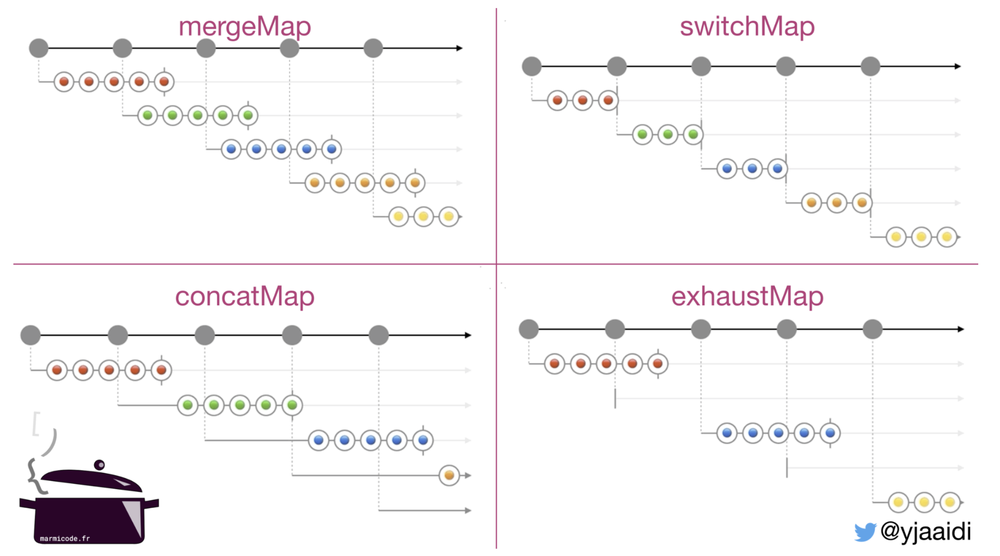

https://marmicode.io/blog/end-to-end-http-request-cancelation-with-rxjs-and-nestjs

-🤯mergeMap: I'm a hard worker, I can prepare multiple orders at the same time ! But I don't respect orders sequence.
-😇concatMap: I respect orders sequence! You will get your order as soon as I finish what I'm currently doing.
-🙄exhaustMap: I'm exhausted ! when I prepare an order, I won't listen to any other order.
-😈switchMap: I'm mean ! your order will be in trash if I receive new one.

https://dev.to/hssanbzlm/switchmap-mergemap-concatmap-and-exhaustmap-like-you-have-never-seen-109o

If you want `.switchMap` to cancel the HTTP requests, you need them to use the same observable stream. The source `Observable` you want to use depends on what exactly is triggering the http requests, but you can manage it yourself using something like `Subject`.

```javascript
const makeRequest$ = new Subject();
const myResponse$ = makeRequest$.pipe(switchMap(() => this.service.getStuff()));
```

You can subscribe to `myResponse$` to get the response. Any time you want to trigger a request, you can do `makeRequest$.next()`.

https://stackoverflow.com/questions/49036074/rxjs-switchmap-with-angular-httpclient/49036341#49036341
